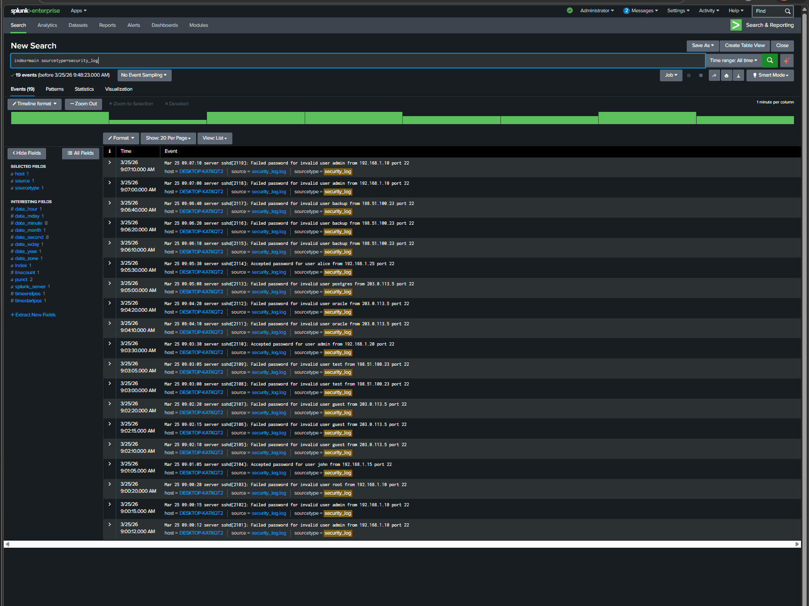
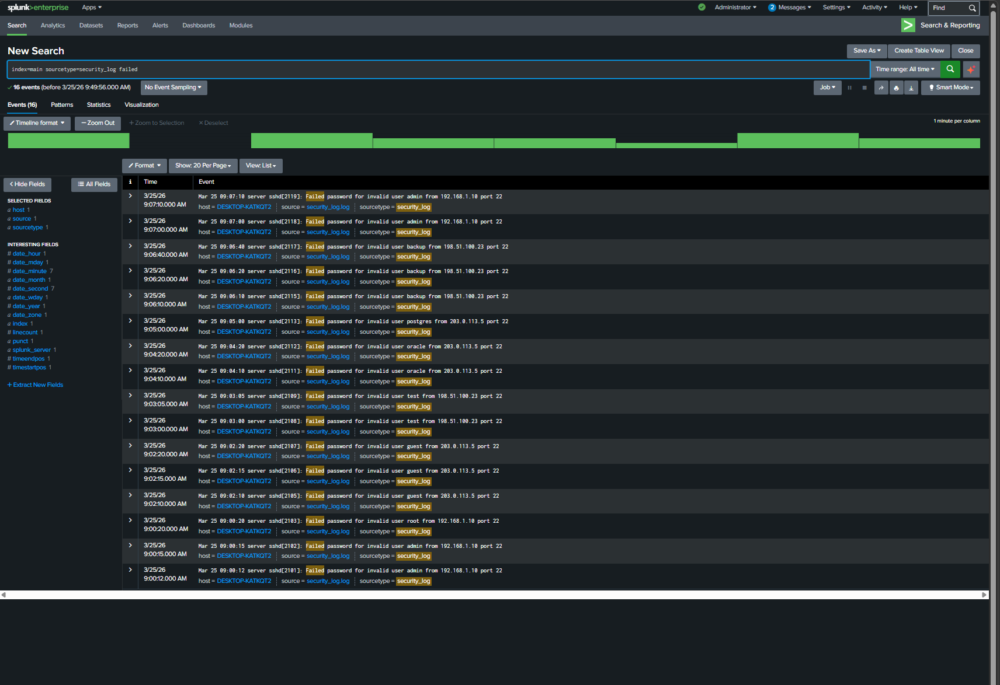
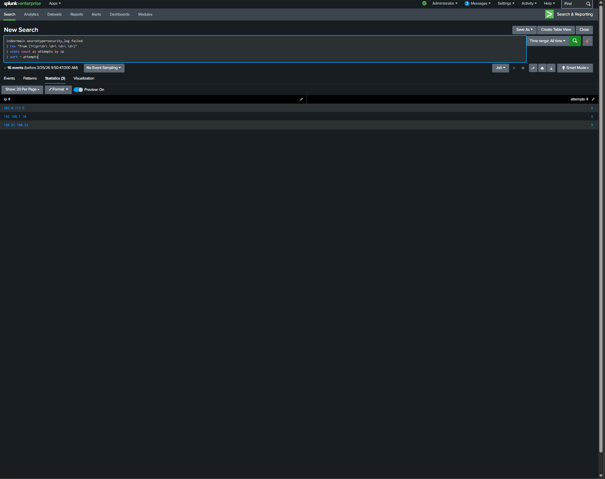

# Cybersecurity Portfolio - Adetayo Adedeji

## About Me

Aspiring SOC Analyst with hands-on experience in log analysis, threat detection, and security investigations. Skilled in identifying suspicious activity and analyzing authentication logs using industry tools.

---

## Skills

* SIEM: Splunk
* Networking: TCP/IP, DNS, HTTP
* Tools: Wireshark, Linux
* Security: Threat Detection, Incident Response
* Log Analysis: Authentication logs, attack detection

---

## Projects

### 🔍 Splunk Log Analysis – Brute Force Detection

#### Overview

This project demonstrates the analysis of SSH authentication logs using Splunk to identify suspicious login activity and detect potential brute-force attacks.

---

#### Investigation Steps

* Ingested log data into Splunk
* Filtered failed login attempts
* Extracted IP addresses using regex
* Aggregated login attempts by IP address
* Identified suspicious patterns

---

#### Findings

* 203.0.113.5 → 6 failed attempts
* 192.168.1.10 → 5 failed attempts
* 198.51.100.23 → 5 failed attempts

Multiple usernames were targeted, including admin, root, guest, oracle, and postgres.

---

#### Security Concern

Successful login events were also identified in the logs, indicating potential unauthorized access following repeated failed attempts.

---

#### Conclusion

The activity is consistent with a brute-force attack. Repeated login attempts from specific IP addresses, combined with successful logins, suggest a possible security compromise.

---

#### Recommendations

* Investigate accounts with successful logins
* Block or monitor suspicious IP addresses
* Implement multi-factor authentication (MFA)
* Enable account lockout policies
* Continuously monitor authentication logs

---

## Screenshots

### All Logs

### Failed Login Attempts

### IP Analysis

---

## Contact

* Email: [adedejiadetayo33@gmail.com](mailto:adedejiadetayo33@gmail.com)
* LinkedIn: (add your link here)
