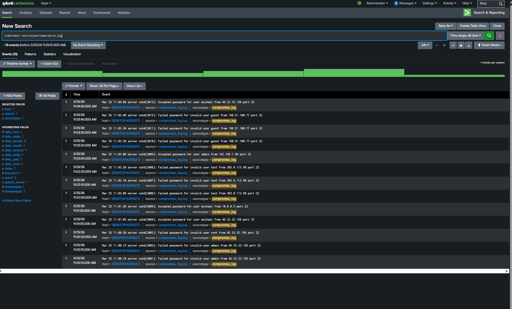
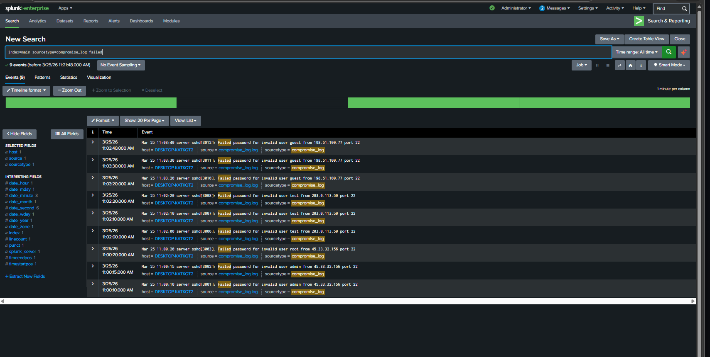
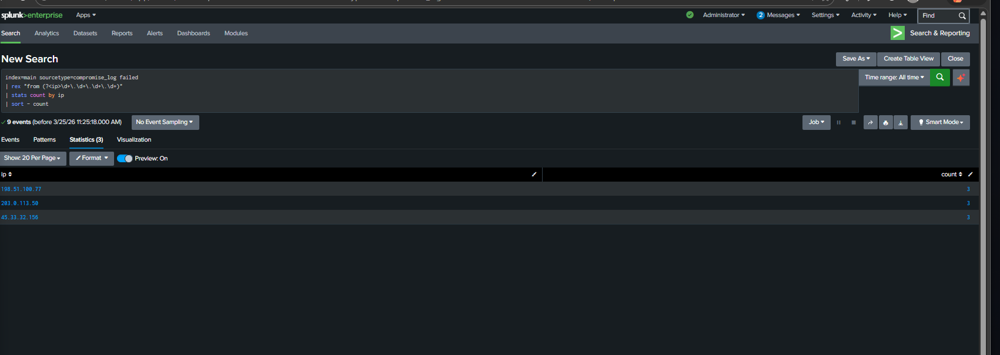
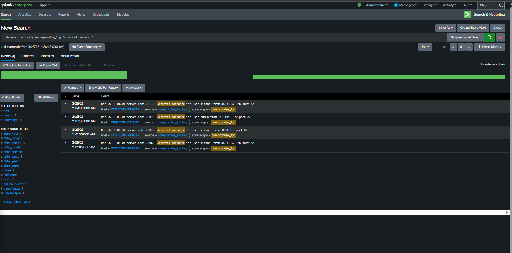
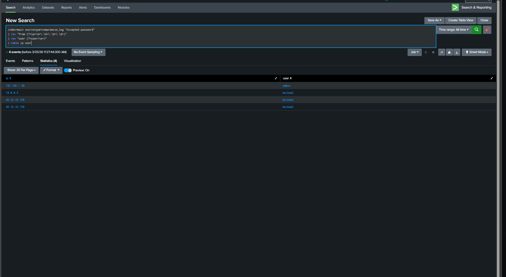

# Splunk Log Analysis – Account Compromise Detection

## Overview

This project demonstrates the detection of a potential account compromise using Splunk by analyzing SSH authentication logs.

---

## Objective

Identify suspicious login behavior, including failed login attempts followed by successful logins from the same IP address.

---

## Tools Used

* Splunk (SIEM)
* SSH authentication logs

---

## Investigation Steps

### 1. View all logs

```
index=main sourcetype=compromise_log
```

---

### 2. Identify failed login attempts

```
index=main sourcetype=compromise_log failed
```

---

### 3. Extract attacker IPs

```
index=main sourcetype=compromise_log failed 
| rex "from (?<ip>\d+\.\d+\.\d+\.\d+)" 
| stats count by ip 
| sort - count
```

---

### 4. Identify successful logins

```
index=main sourcetype=compromise_log "Accepted password"
```

---

### 5. Extract usernames from successful logins

```
index=main sourcetype=compromise_log "Accepted password" 
| rex "user (?<user>\w+)" 
| stats count by user
```

---

## Findings

- Multiple IP addresses attempted failed logins  
- IP 45.33.32.156 performed several failed login attempts  
- The same IP later successfully logged into user account "michael"  
- This indicates the attacker was able to guess the password  

---

## Conclusion

The activity shows a **confirmed account compromise**, where an attacker successfully gained access after multiple failed login attempts.

This is a classic **brute-force attack leading to unauthorized access**.
---

## Security Concern

The pattern of repeated failed attempts suggests a **brute-force attack**, which could eventually lead to account compromise if successful.

---

## Conclusion

This activity indicates a **potential account compromise attempt** through brute-force login attacks.

---

## Recommendations

* Enable multi-factor authentication (MFA)
* Block or monitor suspicious IP addresses
* Implement account lockout policies
* Monitor login activity continuously

---

## Skills Demonstrated

* Log analysis
* Threat detection
* Regex (field extraction)
* SIEM investigation

  ## Screenshots

### 1. All Logs


---

### 2. Failed Login Attempts


---

### 3. Attacker IP Analysis


---

### 4. Successful Logins


---

### 5. IP and User Extraction

