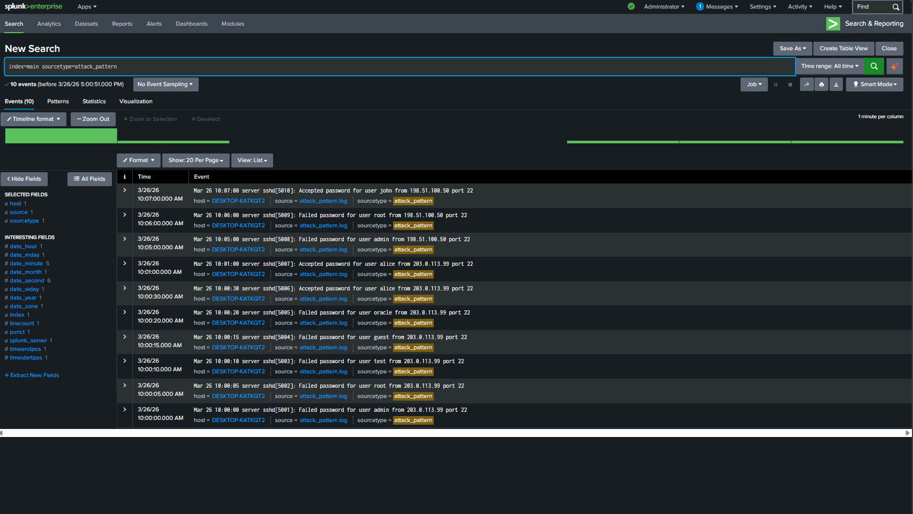
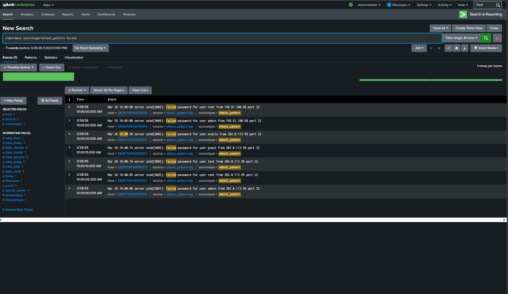
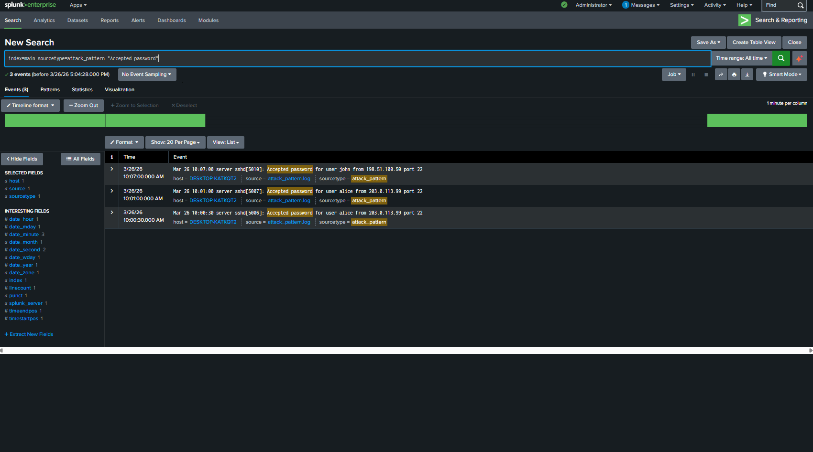
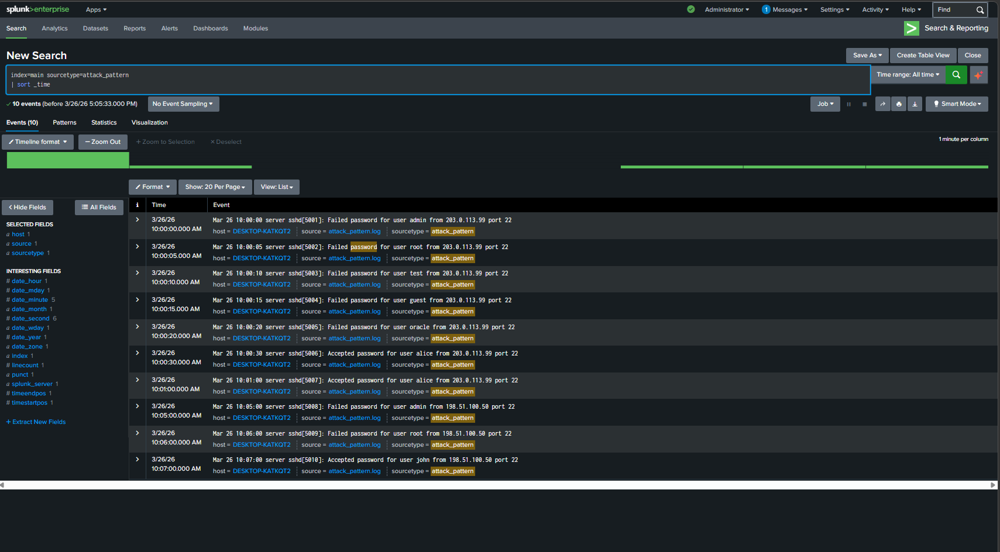
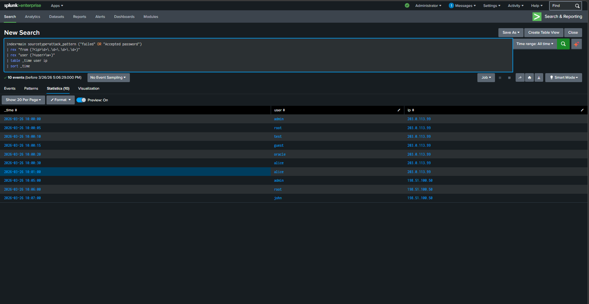

# Splunk Log Analysis – Credential Stuffing / Password Spraying Detection

## Overview

This project investigates a suspicious burst of authentication activity by analyzing SSH logs in Splunk. The goal is to identify attack patterns where a single source attempts access across multiple user accounts.

---

## Objective

To detect password spraying or credential stuffing attacks by identifying multiple failed login attempts across different usernames followed by successful authentication.

---

## Tools Used

* Splunk (SIEM)
* SSH authentication logs

---

## Investigation Steps

### 1. View all logs

```id="q1"
index=main sourcetype=attack_pattern
```

---

### 2. Identify failed login attempts

```id="q2"
index=main sourcetype=attack_pattern failed
```

---

### 3. Identify successful logins

```id="q3"
index=main sourcetype=attack_pattern "Accepted password"
```

---

### 4. Extract IP and user activity

```id="q4"
index=main sourcetype=attack_pattern ("failed" OR "Accepted password")
| rex "from (?<ip>\d+\.\d+\.\d+\.\d+)"
| rex "user (?<user>\w+)"
| table _time user ip
| sort _time
```

---

## Findings

* A single IP address **203.0.113.99** performed multiple login attempts within a short period
* The attacker targeted several usernames:

  * admin
  * root
  * test
  * guest
  * oracle
* All initial attempts resulted in failed logins
* The attacker successfully authenticated into the account **"alice"**

---

## Timeline of Events

* 10:00:00 AM → Failed login (admin)
* 10:00:05 AM → Failed login (root)
* 10:00:10 AM → Failed login (test)
* 10:00:15 AM → Failed login (guest)
* 10:00:20 AM → Failed login (oracle)
* 10:00:30 AM → Successful login (alice)
* 10:01:00 AM → Second successful login (alice)

---

## Security Analysis

* The attacker used a single IP address to attempt multiple usernames rapidly
* This pattern is consistent with **password spraying**, where attackers test common passwords across many accounts
* The successful login indicates that valid credentials for "alice" were obtained or guessed
* This suggests potential password reuse or weak password practices

---

## Conclusion

This activity represents a **confirmed password spraying attack**, where an attacker successfully gained unauthorized access to the account "alice" after multiple failed attempts across different users.

---

## Recommendations

* Reset password for the compromised account (alice)
* Enforce strong password policies
* Enable multi-factor authentication (MFA)
* Monitor for similar attack patterns
* Implement account lockout mechanisms

---

## Skills Demonstrated

* Log analysis
* Pattern recognition
* Threat detection
* Timeline reconstruction
* SIEM investigation

## Screenshots

### 1. All Logs


---

### 2. Failed Login Attempts


---

### 3. Successful Logins


---

### 4. Timeline Analysis


---

### 5. IP and User Analysis

